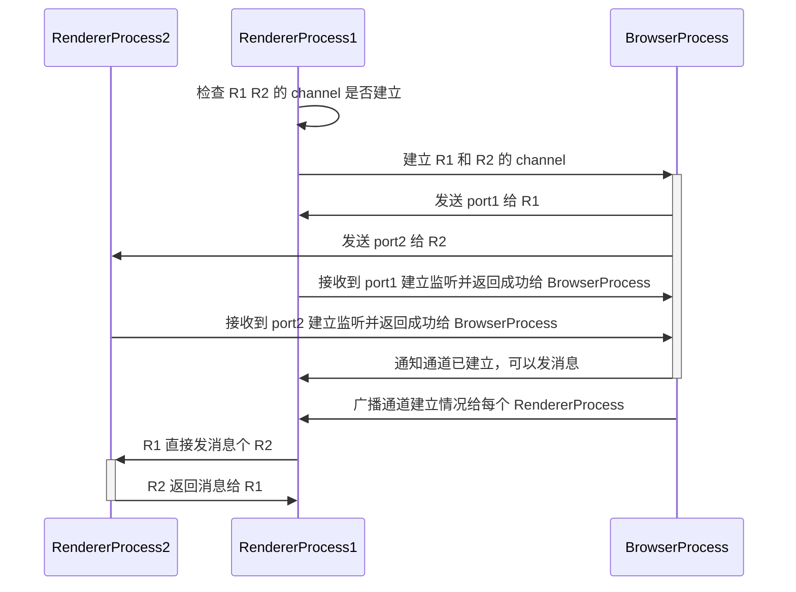

# 窗口间通道的通信

## 背景

因为 electron 27 开始，就不支持 ipc `sentTo` 的接口了，改为两个窗口建立 channel 并直接发消息，所以我们需要基于新的 API 去兼容
ipc-base 里面的 sentTo 接口

## 技术方案
- 使用新提供的 `MessageChannelMain` 和 `electronMessagePort` 按照如下的方案进行适配
## 时序图

